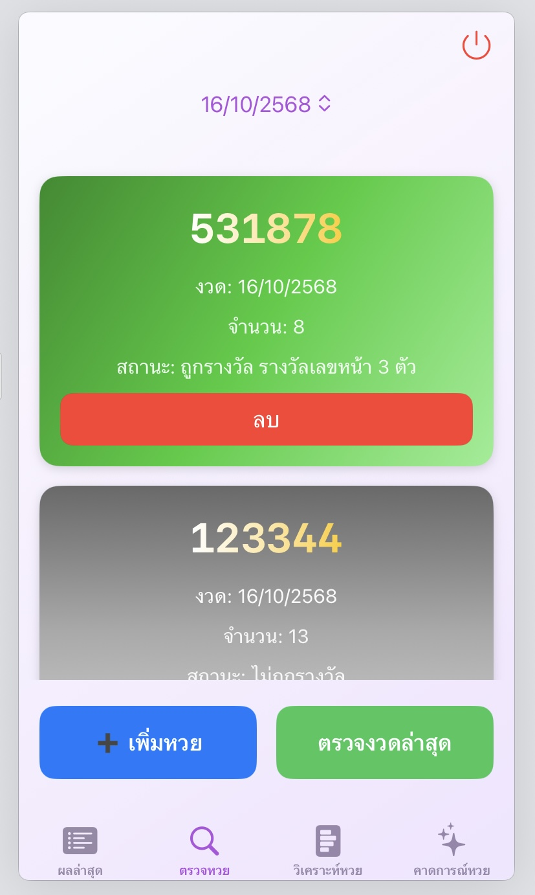

# Lucky Pus – Lottery Tracking & Analysis App (iOS)

Lucky Pus คือแอปพลิเคชันสำหรับบันทึก ตรวจสอบ และวิเคราะห์ผลสลากกินแบ่งรัฐบาลไทยแบบครบวงจร
ออกแบบมาเพื่อช่วยให้ผู้ใช้สามารถติดตามผล ตรวจหวยย้อนหลัง และวิเคราะห์แนวโน้มตัวเลขได้สะดวก รวดเร็ว และแม่นยำมากขึ้น

---

## ที่มาและวัตถุประสงค์ของ Application

ในปัจจุบันการตรวจสอบผลรางวัลสลากกินแบ่งรัฐบาลยังคงเป็นเรื่องยุ่งยากสำหรับผู้ใช้หลายคน
ผู้ใช้มักต้องค้นหาข้อมูลจากหลายแหล่ง เช่น เว็บไซต์ ข่าวทีวี หรือโซเชียล และไม่มีระบบที่ช่วยจัดเก็บหวยที่ซื้ออย่างเป็นระเบียบ
รวมถึงไม่สามารถดูสถิติส่วนตัว เช่น อัตราการถูกรางวัล หรือแนวโน้มตัวเลขได้อย่างง่ายดาย

**Lucky Pus จึงถูกพัฒนาขึ้นเพื่อแก้ปัญหาเหล่านี้**
ด้วยฟีเจอร์ที่ช่วยให้ผู้ใช้สามารถบันทึก ตรวจสอบ และวิเคราะห์สลากที่ซื้อได้ภายในแอปเดียว
พร้อมระบบคาดการณ์เลขงวดถัดไปจากข้อมูลสถิติ เพื่อเพิ่มความสนุกในการใช้งาน

แอปพลิเคชันรองรับบน **iOS** โดยเน้นความใช้งานง่าย (User-Friendly)

---

## วัตถุประสงค์ของการพัฒนา

* พัฒนาแอปที่ช่วยให้ผู้ใช้ตรวจผลสลากได้อย่าง **รวดเร็ว ถูกต้อง และอัปเดตแบบเรียลไทม์**
* อำนวยความสะดวกในการ **บันทึกสลากแต่ละงวดอย่างเป็นระบบและค้นหาย้อนหลังได้**
* วิเคราะห์ข้อมูลส่วนตัว เช่น

  * อัตราการถูกรางวัล
  * จำนวนครั้งที่ถูกรางวัล
  * ยอดเงินรางวัลรวม
* เพิ่มความบันเทิงด้วยระบบ **คาดการณ์แนวโน้มตัวเลขในงวดถัดไป**

---

## กลุ่มผู้ใช้เป้าหมาย

แบ่งเป็น 3 ประเภทหลัก:

### 1) ผู้ใช้ทั่วไปที่ซื้อลอตเตอรี่เป็นประจำ

* ต้องการตรวจรางวัลรวดเร็ว
* ต้องการจัดเก็บข้อมูลสลากย้อนหลังอย่างเป็นระบบ

### 2) ผู้ใช้ที่ซื้อลอตเตอรี่เป็นครั้งคราว

* ต้องการแอปที่ตรวจหวยได้สะดวก รวดเร็ว
* ลดความยุ่งยากในการค้นหาผลจากหลายแหล่ง

### 3) ผู้ใช้ที่ชอบวิเคราะห์ตัวเลข

* สนใจข้อมูลสถิติ เช่น เลขซ้ำ เลขที่ออกบ่อย
* ใช้ข้อมูลประกอบการตัดสินใจซื้อหวยงวดถัดไป

---

# Pain Points & แนวทางแก้ไขของ Lucky Pus

| ลำดับ | Pain Point                              | แนวทางแก้ไขจาก Lucky Pus                           |
| ----- | --------------------------------------- | -------------------------------------------------- |
| 1     | ตรวจผลรางวัลล่าช้า ต้องค้นหาหลายที่     | แสดงผลรางวัลแบบ **เรียลไทม์** + แจ้งเตือนอัตโนมัติ |
| 2     | บันทึกหวยด้วยมือ/ถ่ายรูป เสี่ยงหาย      | ระบบบันทึกสลากแบบ **ดิจิทัลและปลอดภัย**            |
| 3     | ตรวจหวยหลายใบสับสน                      | ระบบตรวจอัตโนมัติ ตรวจทุกใบในคลิกเดียว             |
| 4     | ไม่มีสถิติส่วนตัว เช่น อัตราถูกรางวัล   | ระบบวิเคราะห์ข้อมูล + แสดงสรุปผลชัดเจน             |
| 5     | ต้องเปลี่ยนหลายแอปเพื่อดูผล/ตรวจ/บันทึก | Lucky Pus รวมทุกฟีเจอร์ไว้ **ในแอปเดียว**          |

## ขอบเขตการทำงานของแอป (Core Features)

### 1. ระบบลงทะเบียนและเข้าสู่ระบบ (Authentication)

* สมัครสมาชิกด้วย Username + Password
* รองรับ Face ID / Touch ID เพื่อเข้าสู่ระบบทันที
* หากไม่พบบัญชี ระบบจะสร้างให้โดยอัตโนมัติ

  

---

### 2. เมนู “ผลล่าสุด” (Latest Results)

หน้าหลักหลังจากเข้าสู่ระบบ ใช้สำหรับดูผลการออกรางวัลงวดล่าสุดแบบเรียลไทม์
ระบบจะแสดงรางวัลสำคัญ เช่น:

* รางวัลที่ 1
* เลขหน้า 3 ตัว
* เลขท้าย 3 ตัว
* เลขท้าย 2 ตัว

หากต้องการดูผลแบบละเอียดครบทุกหมวด สามารถกดปุ่ม **“ดูรายละเอียดเพิ่มเติมที่ Sanook”** เพื่อเปิดแหล่งข้อมูลต้นทางได้ทันที

  

---

### 3. ระบบบันทึกข้อมูลสลาก (Lottery Recording)

* บันทึกหมายเลขสลาก 6 หลัก
* เลือกจำนวนใบ (1–100 ใบ)
* ระบบเก็บข้อมูลแยกตามงวด
* งวดปัจจุบัน/งวดหน้า: แก้ไขได้
* งวดย้อนหลัง: ลบได้เท่านั้น

  
  

**สีของการ์ดหวย**

* ม่วง = ยังไม่ตรวจ
* เทา = ไม่ถูก
* เขียว = ถูกรางวัล

---

### 4. ระบบตรวจสอบผลรางวัลอัตโนมัติ (Automatic Checking)

* ตรวจทุกใบภายในงวดในคลิกเดียว
* แสดงผลทันทีว่า “ถูกรางวัล / ไม่ถูกรางวัล”

  

---

### 5. ระบบเพิ่มรูปหลักฐาน (Purchase Proof)

เพิ่มภาพสลากเพื่อยืนยันว่าเป็นผู้ซื้อจริง ป้องกันการอ้างสิทธิ์ในอนาคต

#### ขั้นตอน:

##### 3.1 กดปุ่ม **เพิ่มหลักฐาน**

  

##### 3.2 เลือก **เพิ่ม / เปลี่ยนหลักฐาน**

เลือกรูปจากแกลเลอรี เช่นรูปถ่ายสลากจริง

  

##### 3.3 อัปโหลดและกดยืนยัน

ระบบจะเชื่อมภาพเข้ากับรายการทันที

  

##### 3.4 การ์ดหวยจะมีปุ่ม **ดูหลักฐาน**

เปิดดูหรือเปลี่ยนภาพได้ตลอดเวลา

  

---

### 6. เมนู “วิเคราะห์หวย” (Lottery Analysis)

แสดงข้อมูลสถิติส่วนตัว เช่น:

* จำนวนสลากทั้งหมด
* จำนวนครั้งที่ถูกรางวัล
* อัตราการถูกรางวัล (%)
* มูลค่ารางวัลรวม
* เลขนำโชคจากสถิติที่ผ่านมา

  

---

### 7. เมนู “คาดการณ์หวย” (Prediction System)

* วิเคราะห์ข้อมูลย้อนหลัง
* แสดงแนวโน้มรางวัลต่าง ๆ เช่น รางวัลที่ 1, เลขหน้า 3 ตัว, เลขท้าย 3 ตัว, เลขท้าย 2 ตัว

  

**หมายเหตุ:** ฟีเจอร์นี้ใช้เพื่อความบันเทิงเท่านั้น 

---

### 8. การออกจากระบบ (Logout)

* กดปุ่มสีแดงมุมขวาบน
* กดยืนยันเพื่อกลับสู่หน้า Login

---

## ข้อมูลเพิ่มเติม

* แอปถูกออกแบบเพื่อความบันเทิงและช่วยติดตามผลเท่านั้น
* ไม่รับประกันผลการคาดการณ์
